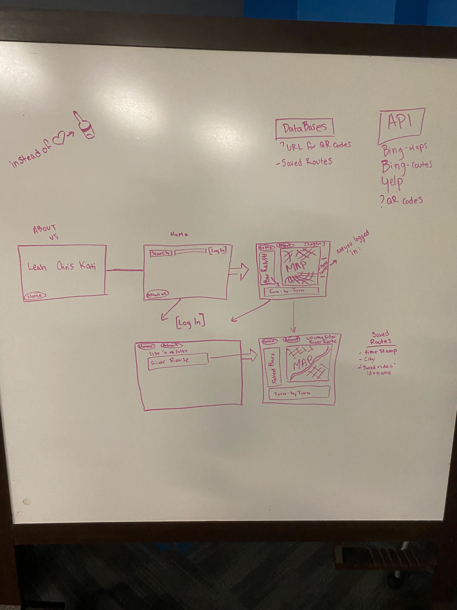
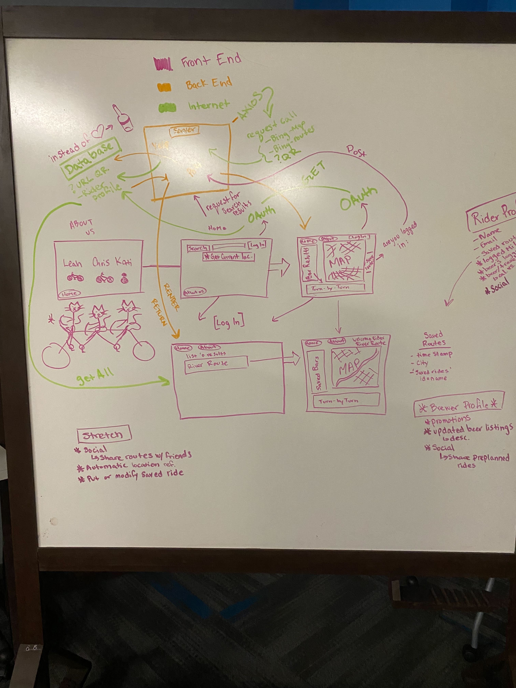
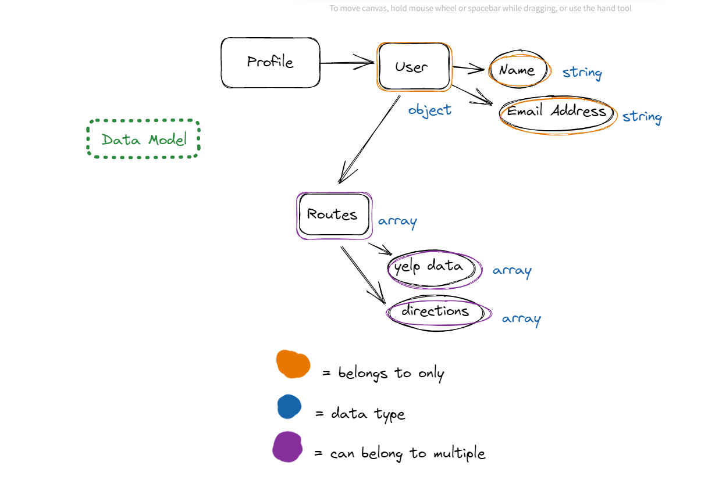

# User Stories:
- As a bar owner, I want a way to draw business in by encouraging return customers. I'd like to draw in the cycling community into my regular clientele.
- As a community organizer I need a way to calculate the distance between different drinking establishments for a fundraising biking bar crawl so that I can raise money for a local non-profit. 
- As a cyclist I want a way to locate different bars and create a route linking them so that I can enjoy a bike ride and craft beers.
- As a bike shop owner I would like a way to organize group rides where we can enjoy our community and support local businesses. 
- As a member of the trail alliance I want to help others enjoy our local bike trails and create awareness of how extensive they are.
- As a cyclist who is participating in ragbri, I need a way to go into other communities I’m not familiar with and be able to navigate them to get to enjoy the local pubs. 

